load balance 

instances
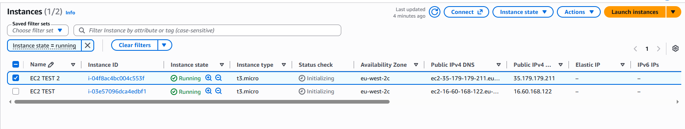

Target group
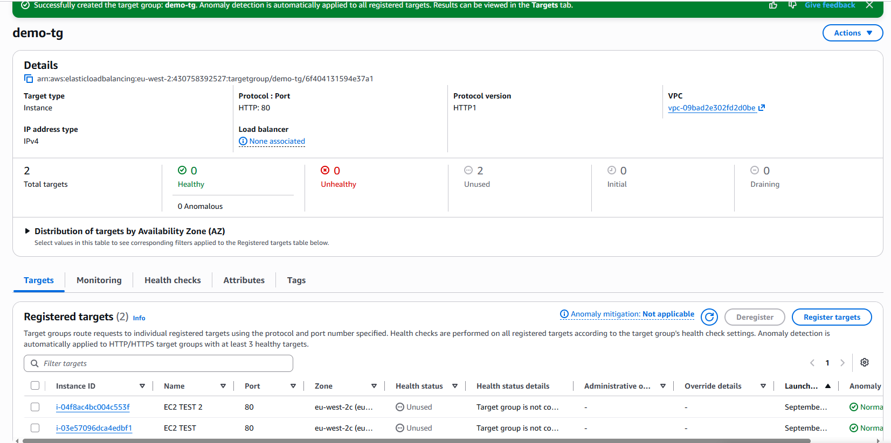
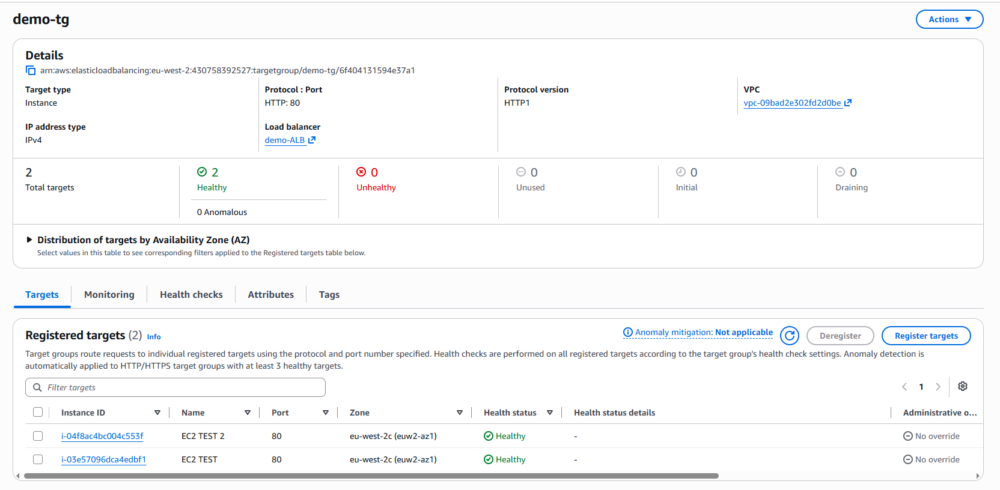

same az

ALB
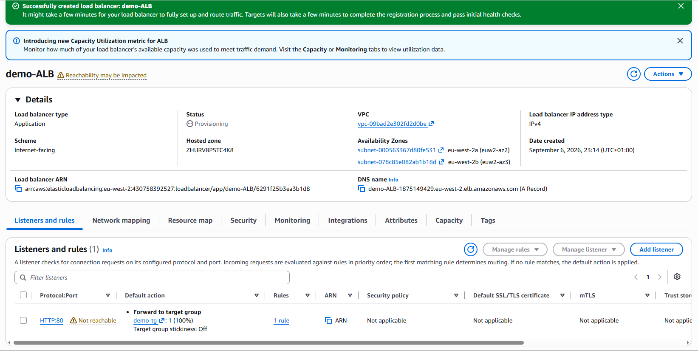

VPC 

vpc with /16 cider 
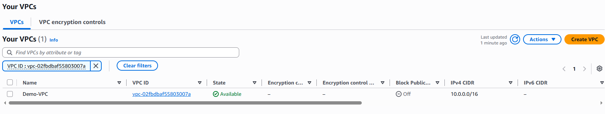

subnets 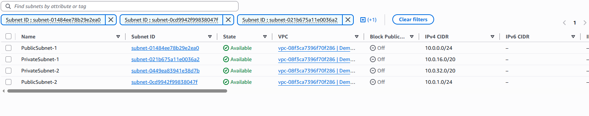

instance in the subnet 
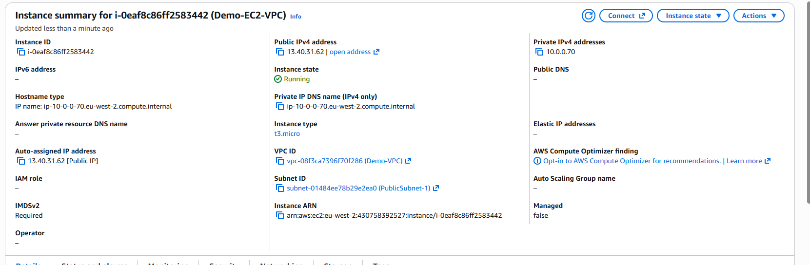

routtables 

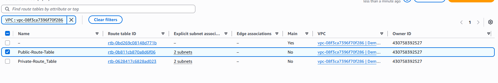

IGW 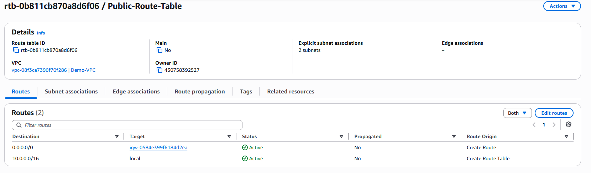

NGW 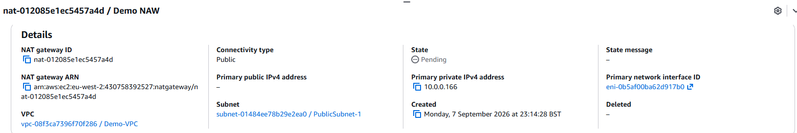

rout traffic to the NGW

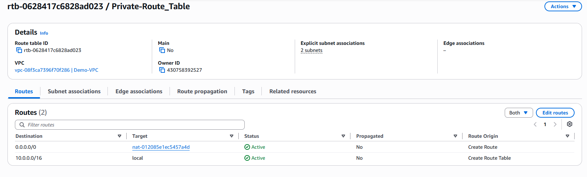

ssh into provate ecc2 using nastion host 
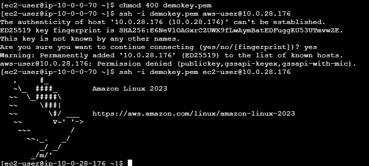

ping www.bbc.co.uk top show intertnet access 
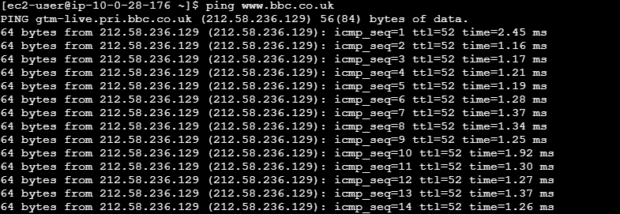