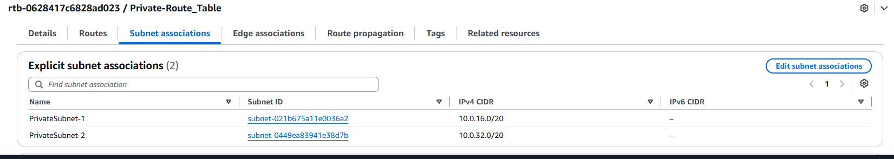

# AWS VPC

## 1. Create the VPC

I created a VPC using a `/16` CIDR block. This gives the VPC a large private IP address range that can be divided into smaller subnets.

## 2. Create the Subnets

I created four subnets inside the VPC:

- A public subnet for the Bastion Host.
- A private subnet for the private EC2 instance.

The public subnet will have access to the internet through an Internet Gateway, while the private subnet will use a NAT Gateway for outbound internet access.

## 3. Create the EC2 Instances

I launched an EC2 instance inside the subnet.

The Bastion Host is placed in the public subnet so that I can SSH into it from my own computer. The private EC2 instance is placed in the private subnet and does not have direct internet access.

## 4. Create the Route Tables

I created route tables to control where traffic from each subnet should go.

The public route table sends internet traffic to the Internet Gateway, while the private route table sends internet-bound traffic to the NAT Gateway.

## 5. Internet Gateway

I created and attached an Internet Gateway to the VPC.

The Internet Gateway provides a connection between the VPC and the public internet. It is used by the public subnet.

## 6. NAT Gateway

I created a NAT Gateway for the private subnet.

The NAT Gateway allows the private EC2 instance to make outbound connections to the internet without giving the instance a public IP address.

## 7. Route Private Traffic Through the NAT Gateway

I added a route so that traffic from the private subnet destined for the internet is sent through the NAT Gateway.

The traffic path is:

`Private EC2 → NAT Gateway → Internet Gateway → Internet`

## 8. SSH Into the Private EC2 Instance

I connected to the private EC2 instance through the Bastion Host.

The private instance cannot be accessed directly from the internet, so the Bastion Host acts as an intermediate server:

`My PC → Bastion Host → Private EC2`

## 9. Test Internet Access

From the private EC2 instance, I tested internet connectivity using:
ping www.bbc.co.uk

