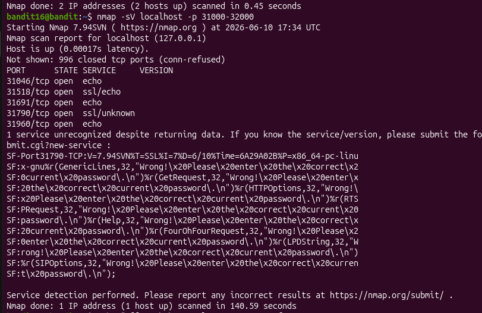

## level 13 > 14

**Challenge:** The password for the next level can be retrieved by using the current password to log in via SSH on localhost.

**Solution:**
saved the private SSH key to a file  and connected with `ssh -i sshkey.private bandit14@localhost`. Once logged in, used `cat /etc/bandit_pass/bandit14` to read the password.

**What I learned:**#
SSH key authentication is an alternative to password authentication. Using the `-i` option allows you to specify a private key, which is often more secure and commonly used for automated access and server administration.(I guess this is what people actually use instead of passwords)

## level 14 > 15

**Challenge:** Submit the password for the current level to a service listening on port `30000` on localhost to receive the password for the next level.

**Solution:**
used `cat /etc/bandit_pass/bandit14 | nc localhost 30000` to send the current password to the service and receive the password for the next level.

**What I learned:**
`nc` can open TCP or UDP connections, send data, and listen on ports. google calls it the Swiss Army knife of networking because it is useful for testing services and communicating directly. I guess the powerhsll equivalent of this is Test-NetConnection

PASS : 8xCjnmgoKbGLhHFAZlGE5Tmu4M2tKJQo
## level 15 > 16

**Challenge:** Submit the current password to a service listening on port `30001` using SSL/TLS encryption.

**Solution:**
used `openssl s_client -connect localhost:30001`, entered the current password after the connection was established, and received the password for the next level.

**What I learned:**
`openssl s_client` can be used to establish encrypted SSL/TLS connections to servers for testing and debugging. Unlike `nc`, it handles the TLS handshake before allowing data to be exchanged securely.

## level 16 > 17
**Challenge:** 
find out which port out of a reang has a server listening on them. Then find out which of those speak SSL/TLS and which dont. then submit the current passowrd to to receve the pass for the next level. 
**Solution:**
I used `namp -sV ` to search the port range for for ports that speak ssl. then used `openssl s_client -connect localhost` to connect to the and enter the. as before i used vim to save the key and chmod to change its permissions.

**What I learned:**
nmap can be used to scan though a reange of ports and sv can be used for version detection. 

## level 17 > 18
**Challenge:** 
 compare the two files and find which line is diffrent
**Solution:**
used `diff` to find the lines 

**What I learned:** 
diff is cool 

## level 18 > 19
**Challenge:**
read the file in the home directory before i am logged out 
**Solution:**
used the ssh command to add the comand `"cat readme"` 

**What I learned:** 

you can specify a command after i have specied the destination when using a ssh. !
[alt text](image-2.png)

## level 19 > 20
**Challenge:**

**Solution:**

**What I learned:** 

