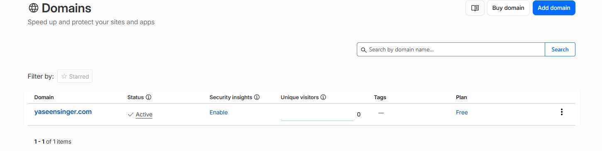
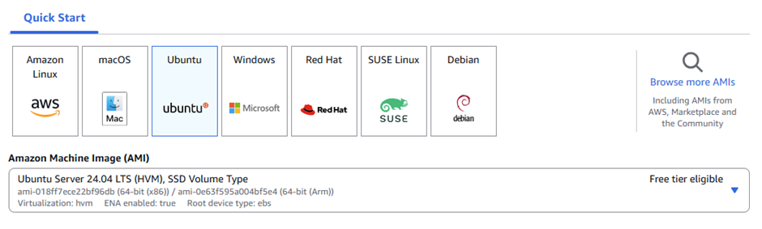
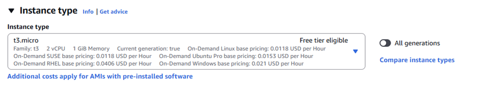
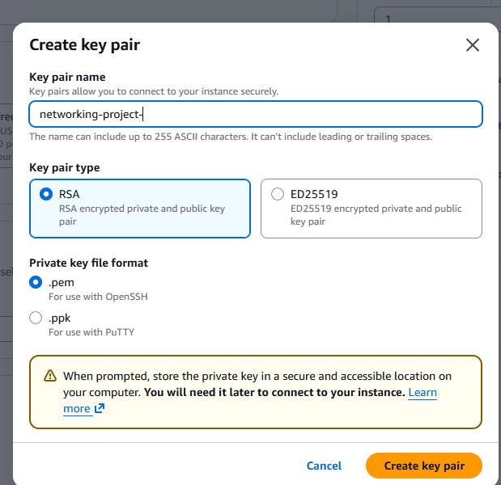
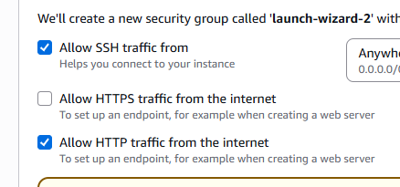
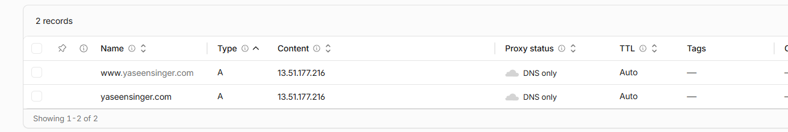
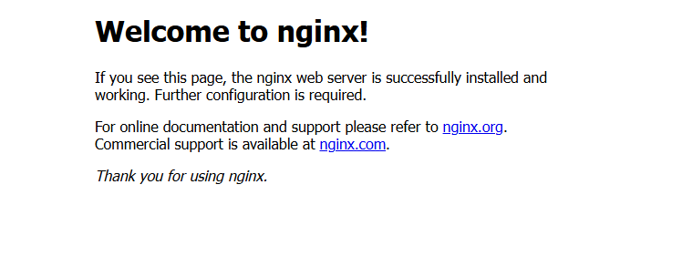

# Deploying My First AWS EC2 Web Server with NGINX and a Custom Domain

## Project Overview

As part of developing my cloud and infrastructure skills, I wanted to gain hands-on experience deploying a web server from scratch. I decided to provision my own virtual machine in AWS, configure a web server manually, and connect it to a custom domain that I had purchased.

The goal of this project was to:

- Launch and configure an AWS EC2 instance  
- Connect securely to the server using SSH  
- Install and configure NGINX  
- Point a custom domain to the server using Cloudflare DNS  

Before starting the deployment, I created a simple plan outlining the major stages of the project:

- Purchase a domain name  
- Launch an EC2 instance  
- Install and configure NGINX  
- Configure DNS records  
- Verify domain connectivity  
- Deploy web content  

---

## Purchasing a Domain Name

I purchased the domain **yaseensinger.com** from Cloudflare, which cost me £5.



---

## Launching an EC2 Instance

- I created an AWS free tier account and launched an EC2 instance running Ubuntu.  
  

- The instance type I chose was **t3.micro**, as it is eligible for the free tier.  
  

- I also created a key pair so I could securely SSH into the instance.  
  

- I made sure that HTTP traffic was allowed in the security group so the website could be accessed publicly.  
  

---

## SSH into the Instance

I downloaded the key pair and added it to my project folder, then changed the permissions to make it readable only by me.

I then connected to the instance using SSH:

```bash
ssh -i your-key.pem ubuntu@YOUR_PUBLIC_IP
```
After connecting, I updated the package list:
```bash
sudo apt update
sudo apt upgrade -y
```
Then I installed NGINX:
```bash
sudo apt install nginx -y
```
After installation, I started and enabled the service:
```bash
sudo systemctl start nginx
sudo systemctl enable nginx
DNS Check
```
---

## DNS Check

To confirm networking and domain setup, I used nslookup to verify DNS resolution for my domain.
```bash
nslookup yaseensinger.com
Pointing My Domain to the IP Address
```
In Cloudflare, I created two DNS A records in my domain’s zone file:
- @ (root domain)
- www

--- 

## Pointing My Domain to the IP Address

Both were pointed to my EC2 public IP address.

Verifying Domain Connectivity

After configuring DNS, I tested the setup by visiting my domain in the browser:

http://yaseensinger.com

At this stage, I was checking whether the domain correctly resolved to my EC2 instance and whether NGINX was serving the default page successfully.

